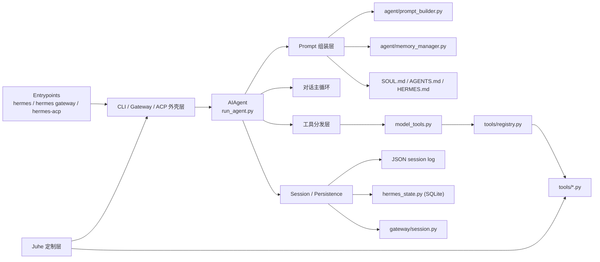
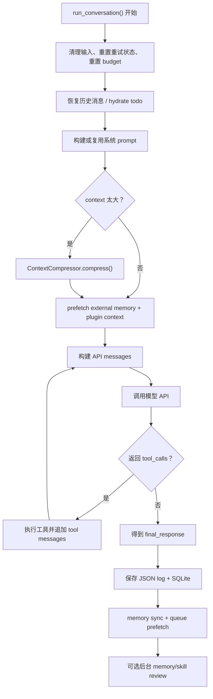
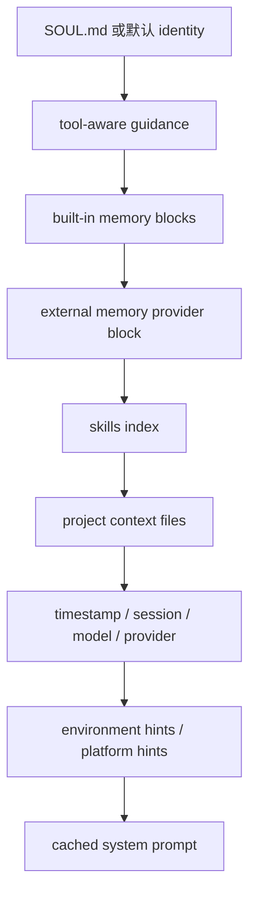
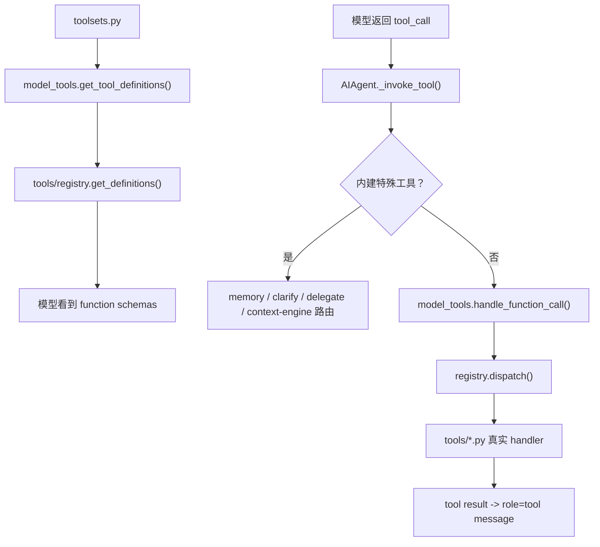
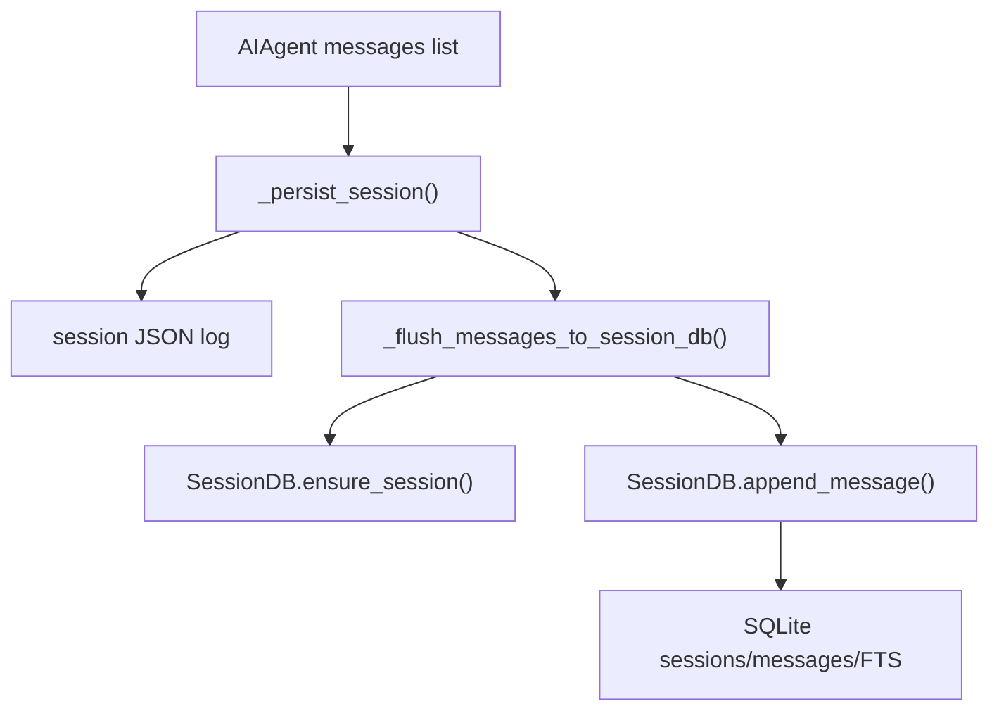
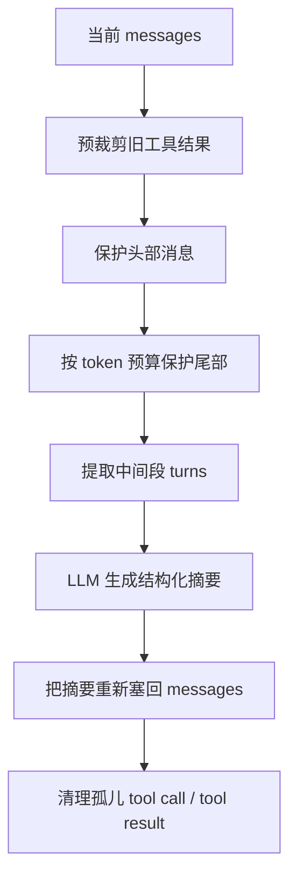
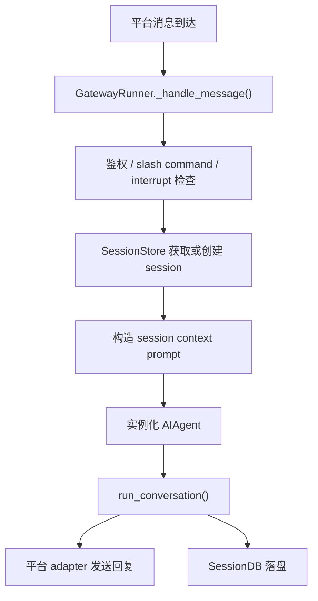
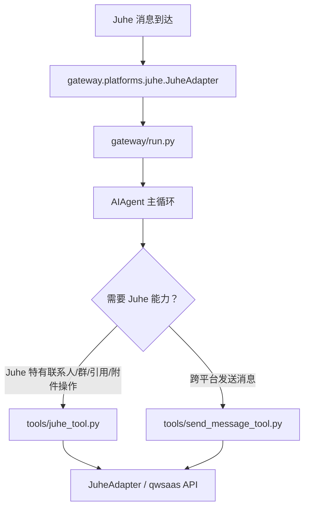
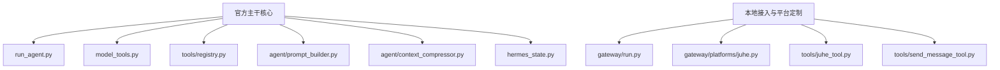

# Hermes 核心架构与源码学习指南（中文）

**文档日期：** 2026-04-22  
**适用仓库：** `hermes-agent`  
**本地工作分支：** `custom/juhe-platform`  
**官方上游：** [NousResearch/hermes-agent](https://github.com/NousResearch/hermes-agent)  
**官方架构文档：** [Hermes Architecture](https://hermes-agent.nousresearch.com/docs/developer-guide/architecture)

---

## 这份文档是给谁看的

这份文档面向两类读者：

1. 想快速弄清楚 Hermes “主脑”到底在哪里、整体是怎么跑起来的人。
2. 想从本地这套 `custom/juhe-platform` 定制代码出发，系统学习 Hermes 源码的人。

文档风格采用“概念讲解 + 源码导读 + 流程图”的混合方式：

- 先解释 Hermes 里哪些目录、哪些文件是真正重要的。
- 再解释一轮对话从入口到结束，内部经历了哪些关键步骤。
- 然后把工具系统、会话系统、记忆系统、上下文压缩系统拆开讲。
- 最后再单独说明 Juhe 定制是挂在 Hermes 哪一层上的。

如果你只想先记住一句话：

> Hermes 的核心脑子是 [`run_agent.py`](../../run_agent.py) 里的 `AIAgent`。  
> `CLI`、`gateway`、`ACP` 都是入口层；`model_tools.py` 和 `tools/registry.py` 是工具中枢；`Juhe` 是接入与扩展层，不是主脑。

---

## 一、先分清三个“不同的 Hermes”

很多人第一次看 Hermes 会把“运行目录”和“源码主仓库”混在一起。你本地这套环境里，至少有下面三个概念：

### 1. 官方主工程

Hermes 的官方上游主工程是：

- [NousResearch/hermes-agent](https://github.com/NousResearch/hermes-agent)

这是官方公开维护的主仓库，也是 Hermes 的“Nous 主工程”。

### 2. 运行时家目录

你本地的 Hermes 运行时家目录是：

- `~/.hermes`

也就是当前环境中的：

- `/Users/chou/.hermes`

这个目录主要放：

- 配置
- 日志
- 会话数据
- 状态数据库
- 用户 skills
- gateway 运行时文件
- 源码 checkout

它不是 Git 主仓库本身，而是 Hermes 的“home + runtime workspace”。

### 3. 真正的源码主仓库

你本地真正的源码主工程是：

- `/Users/chou/.hermes/hermes-agent`

也就是当前文档所在的 Git 仓库。

安装入口在 [`pyproject.toml`](../../pyproject.toml) 中定义得很清楚：

- `hermes = "hermes_cli.main:main"`
- `hermes-agent = "run_agent:main"`
- `hermes-acp = "acp_adapter.entry:main"`

因此从“源码核心”角度看，真正值得研究的是 `hermes-agent/` 这棵树，而不是 `~/.hermes` 根目录里的运行时文件。

---

## 二、Hermes 的总体架构图

先看一张总图，建立第一层心智模型。

这张图里最重要的判断是：

- **入口层不是主脑。** `CLI` 和 `gateway` 只是把输入送进 `AIAgent`。
- **`AIAgent` 才是 Hermes 的核心执行引擎。**
- **工具系统是独立子系统。** `model_tools.py` 决定“给模型看哪些工具”和“如何调用工具”，`tools/registry.py` 决定“工具如何注册与分发”。
- **状态层是独立子系统。** `hermes_state.py` 负责 SQLite 会话存储，`gateway/session.py` 负责 gateway 语义下的 session 管理。
- **Juhe 是挂接层。** 它影响消息接入、附件桥接、发送通道和工具能力，但不替代 Hermes 主脑。

---

## 三、核心文件地图

下面这张“文件地图”建议你先收藏。以后迷路时，先回来看这一节。

| 层级 | 关键文件 | 作用 | 学完会得到什么 |
|---|---|---|---|
| 命令入口 | [`hermes_cli/main.py`](../../hermes_cli/main.py) | `hermes` 命令主入口，负责分流 CLI / gateway / 其他子命令 | 知道 Hermes 从哪里启动 |
| CLI 编排 | [`cli.py`](../../cli.py) | 交互式终端、斜杠命令、会话恢复、UI 控制 | 知道 CLI 怎么接到主脑 |
| Gateway 编排 | [`gateway/run.py`](../../gateway/run.py) | 消息平台接入、鉴权、interrupt、session、调用 agent | 知道消息平台怎么接到主脑 |
| 主脑 | [`run_agent.py`](../../run_agent.py) | `AIAgent`、系统 prompt、对话循环、工具回路、持久化 | 知道 Hermes 真正怎么思考和执行 |
| 工具中枢 | [`model_tools.py`](../../model_tools.py) | 工具发现、工具过滤、工具调用入口 | 知道模型为什么能“看到工具” |
| 工具注册表 | [`tools/registry.py`](../../tools/registry.py) | 工具注册、schema 暴露、handler 分发 | 知道工具如何被统一管理 |
| Toolset 定义 | [`toolsets.py`](../../toolsets.py) | 定义默认工具集合与各平台工具集 | 知道不同入口启用了哪些工具 |
| Prompt 组装 | [`agent/prompt_builder.py`](../../agent/prompt_builder.py) | 把 identity、memory、skills、context files 拼成系统提示 | 知道 Hermes 为什么有“人格”和“项目上下文” |
| 记忆编排 | [`agent/memory_manager.py`](../../agent/memory_manager.py) | 统一协调内置 memory 和外部 memory provider | 知道 Hermes 如何 recall 和记忆扩展 |
| 上下文压缩 | [`agent/context_compressor.py`](../../agent/context_compressor.py) | 长对话压缩、摘要、中间上下文折叠 | 知道 Hermes 如何对抗 context 爆炸 |
| SQLite 状态底座 | [`hermes_state.py`](../../hermes_state.py) | session、message、FTS、写入重试、WAL 管理 | 知道对话数据怎么落库 |
| Gateway session 包装 | [`gateway/session.py`](../../gateway/session.py) | gateway 场景的 session 查找、恢复、上下文拼接 | 知道消息平台会话是怎么维持的 |
| Juhe 平台适配 | [`gateway/platforms/juhe.py`](../../gateway/platforms/juhe.py) | Juhe 平台消息接入与发送适配 | 知道 Juhe 在 gateway 哪一层 |
| Juhe 专用工具 | [`tools/juhe_tool.py`](../../tools/juhe_tool.py) | 给模型暴露 Juhe 特有操作 | 知道 Juhe 为什么能被模型直接调用 |
| 跨平台消息工具 | [`tools/send_message_tool.py`](../../tools/send_message_tool.py) | 跨平台发送消息，也支持 `juhe` 作为发送平台 | 知道 Juhe 如何参与 Hermes 的通用发送能力 |

---

## 四、入口层：Hermes 从哪里启动

Hermes 的命令入口分为三类：

1. `hermes`
2. `hermes gateway`
3. `hermes-acp`

安装脚本入口定义在 [`pyproject.toml`](../../pyproject.toml) 中，而仓库里的 [`hermes`](../../hermes) 只是一个非常薄的启动包装器：最终调用的是 [`hermes_cli.main:main`](../../hermes_cli/main.py)。

### 4.1 CLI 入口

CLI 主入口函数在：

- [`hermes_cli/main.py`](../../hermes_cli/main.py)

这里会做几件关键事：

- 解析命令行参数
- 应用 `profile` 覆盖
- 加载 `.env`
- 初始化日志
- 判断是否进入 `gateway`
- 否则进入 CLI 交互流程

可以把它理解成：

> “Hermes 命令行启动总控台”

### 4.2 CLI 命令分流

CLI 主体逻辑集中在：

- [`cli.py`](../../cli.py)

其中 `HermesCLI` 是交互式外壳类，负责：

- TUI / REPL
- slash commands
- model 切换
- session 恢复
- 调用 `AIAgent`

slash 命令处理入口在：

- [`HermesCLI.process_command()`](../../cli.py)

这层不是智能主脑，而是“人机交互编排层”。

### 4.3 Gateway 入口

Gateway 的主入口在：

- [`gateway/run.py`](../../gateway/run.py)

这是消息平台版的“总控台”。它负责：

- 收消息
- 做平台鉴权
- 判断是否命中 slash command
- 判断是否需要 interrupt 正在运行的 agent
- 获取或创建 session
- 最后把 prompt 送进 `AIAgent`

所以无论用户是通过 CLI、Telegram、Discord，还是 Juhe 进来，最终都要落到同一个 `AIAgent` 上。

---

## 五、主脑：AIAgent 到底做什么

Hermes 的真正执行核心是：

- [`run_agent.py`](../../run_agent.py) 中的 `AIAgent`

`AIAgent` 可以理解成 Hermes 的“对话执行内核”。它负责：

- 初始化模型客户端
- 选择和加载工具
- 构建系统提示
- 管理上下文
- 调用模型
- 执行工具
- 处理工具结果
- 做上下文压缩
- 做 recall 和记忆同步
- 写入 session

### 5.1 AIAgent 的初始化阶段

`AIAgent.__init__()` 会做很多事情，但最关键的是下面几件：

1. 初始化模型客户端与 provider 路由。
2. 读取本轮可用工具：
   - 通过 [`get_tool_definitions()`](../../model_tools.py) 获取。
3. 记录 `valid_tool_names`。
4. 创建或接入 session。
5. 初始化 checkpoint 管理器。
6. 初始化 memory manager。
7. 初始化 context compressor。
8. 缓存系统 prompt。

这说明 Hermes 在一轮真正对话开始前，已经先准备好了三样关键资源：

- 模型
- 工具
- 上下文机制

### 5.2 单轮执行主循环图

下面这张图是本地学习 Hermes 最重要的一张图。

### 5.3 单轮执行拆解

下面按实际顺序解释这条主循环。

#### 第 1 步：输入清理与预算重置

一轮开始时，Hermes 会先做安全清理：

- 清理非法 Unicode surrogate
- 清空上轮遗留的重试状态
- 重新建立 iteration budget
- 清除 stale interrupt 状态

这一阶段的目标是：

> 把本轮对话放进一个“干净、可控、可中断”的执行环境里

#### 第 2 步：恢复对话上下文

如果这是多轮会话，Hermes 会载入历史消息，并补做一些恢复工作，例如：

- todo store 的恢复
- session 的恢复
- 旧消息的重用

这说明 Hermes 的“会话连续性”并不是靠模型记忆，而是靠显式消息历史和状态恢复。

#### 第 3 步：预检查上下文大小

Hermes 会估算当前 prompt 大小，如果已经接近上下文阈值，就触发：

- [`ContextCompressor.compress()`](../../agent/context_compressor.py)

压缩并不是“整个历史都丢掉”，而是：

1. 保头部
2. 保尾部
3. 中间段做结构化摘要
4. 清理旧工具输出
5. 修正 tool call / tool result 对齐关系

这套机制是 Hermes 长会话能力的重要基础。

#### 第 4 步：外部记忆预取

在主循环真正开始前，Hermes 会对外部 memory provider 做一次 recall / prefetch。

重要细节是：

- 这一步不是每个工具调用都重新做
- Hermes 会缓存本轮 recall 结果
- recall 内容通常会临时注入当前 user message，而不是污染 system prompt

这样设计的好处是：

- 降低外部 memory 调用次数
- 保持系统 prompt 稳定
- 提高 provider prompt cache 命中率

#### 第 5 步：构造 API messages

Hermes 接下来会组装送给模型的真正消息内容：

- system prompt
- conversation history
- 当前 user message
- 临时 recall 注入
- plugin 注入内容
- prefill messages

这里有一个很值得学习的设计：

> 外部 recall 与 plugin context 尽量注入到当前 user turn，而不是 system prompt。

原因是：

- system prompt 尽量保持稳定，便于缓存
- 临时上下文不应该永久污染整个 session 结构

#### 第 6 步：调用模型 API

Hermes 支持不同 API 模式，例如：

- Chat Completions
- Codex Responses
- Anthropic Messages

这一层还做了很多工程化处理：

- streaming / non-streaming
- 空响应检测
- malformed response 检测
- fallback provider 切换
- length continuation
- thinking budget exhausted 处理
- truncated tool call 重试

这说明 Hermes 的主循环不是“调用一次模型就完了”，而是一套很重的容错执行框架。

#### 第 7 步：工具回路

如果模型返回 `tool_calls`，Hermes 不会立刻结束，而是进入“工具回路”：

1. 解析工具名与参数
2. 分发到正确执行路径
3. 获取 JSON 结果
4. 把结果作为 `role=tool` 消息追加回历史
5. 再次调用模型

这就是标准 agent loop 的核心。

#### 第 8 步：得到最终响应

如果模型这轮不再返回工具调用，而是返回纯回答内容，Hermes 就会认为这一轮到达收束阶段，得到：

- `final_response`

同时还会顺手处理：

- `<think>` 清洗
- partial response 组装
- 最终 assistant message 写回消息列表

#### 第 9 步：持久化

Hermes 在退出路径上会把 session 同时写到两套地方：

1. JSON session log
2. SQLite session DB

这样做的好处是：

- 调试方便
- 恢复会话方便
- 出错时不容易整轮丢失

#### 第 10 步：记忆同步与后台 review

本轮结束后，Hermes 还会做两类“后处理”：

1. 同步记忆
2. 异步触发 memory / skill review

也就是说：

> Hermes 的学习、记忆和技能维护，并不一定在主回答中和用户抢模型注意力，而是尽量放到回答之后后台进行。

---

## 六、系统 Prompt 是怎么拼出来的

Hermes 的系统提示不是一整块硬编码字符串，而是多层组装的。

### 6.1 Prompt 组装图

### 6.2 Prompt 的各层来源

Prompt 组装入口在：

- [`run_agent.py`](../../run_agent.py) 的 `_build_system_prompt()`

大致顺序是：

1. `SOUL.md` 或默认 identity
2. 针对已加载工具的行为指导
3. 内置 memory block
4. 外部 memory provider block
5. skills 索引 prompt
6. 项目上下文文件
7. 时间戳 / model / provider
8. 环境提示
9. 平台提示

### 6.3 为什么要单独讲 Skills Prompt

skills prompt 的构造在：

- [`agent/prompt_builder.py`](../../agent/prompt_builder.py)

这部分做得很工程化：

- 有进程内缓存
- 有磁盘 snapshot
- 会过滤 disabled skills
- 会按平台过滤
- 会按当前工具集合过滤

这意味着 Hermes 并不是把 `~/.hermes/skills` 整个目录生硬扔给模型，而是会构造一个“可用技能索引”。

### 6.4 为什么要单独讲 Context Files

项目上下文文件加载逻辑也很值得学习：

- 优先 `.hermes.md / HERMES.md`
- 然后 `AGENTS.md`
- 然后 `CLAUDE.md`
- 再然后 `.cursorrules`

它还会做 prompt injection 风险扫描，不是无脑读入。

因此 Hermes 的项目上下文机制本质上是：

> 读取本地工作目录中的“高优先级项目规则文件”，并以系统上下文形式注入模型。

---

## 七、工具系统：Hermes 为什么能“看见并调用工具”

Hermes 的工具系统分成三层：

1. toolsets 定义“允许哪些工具出现”
2. model_tools 决定“这一轮把哪些 schema 暴露给模型”
3. registry 决定“工具真正如何执行”

### 7.1 工具系统总图

### 7.2 Toolset 层

默认核心工具集定义在：

- [`toolsets.py`](../../toolsets.py)

最关键的是：

- `_HERMES_CORE_TOOLS`

这个列表基本决定了 CLI 和各消息平台默认能用什么。

所以如果你以后问：

> “为什么某个工具在 CLI 能用，在别的平台不一定能用？”

答案往往先从 `toolsets.py` 找。

### 7.3 model_tools 层

`model_tools.py` 的核心职责有两个：

1. 调用 `discover_builtin_tools()`，让工具模块自注册。
2. 根据 `enabled_toolsets / disabled_toolsets` 组装出最终暴露给模型的 schema 列表。

这层的关键价值在于：

- 它把“工具发现”和“工具使用”统一到了一个地方。
- 它对上游 `AIAgent` 提供非常清晰的接口。

### 7.4 registry 层

工具注册表在：

- [`tools/registry.py`](../../tools/registry.py)

它的设计非常 Hermes：

- 每个工具模块在 import 时调用 `registry.register()`
- registry 存储 schema、handler、toolset、availability check
- 执行时统一走 `dispatch()`

换句话说：

> Hermes 的工具不是手写一张巨大的“工具表”，而是让工具模块自己声明自己。

这很适合不断扩展的 agent 工具生态。

### 7.5 为什么还有一层 `_invoke_tool()`

虽然 registry 很重要，但 Hermes 还保留了 `AIAgent._invoke_tool()` 这一层。

这是因为有些“工具”并不完全适合走统一 registry，例如：

- 内建 memory
- clarify
- delegate_task
- context engine tools
- 外部 memory provider tools

这使得 Hermes 的工具系统呈现出一个现实工程上的折中：

- 通用工具走 registry
- 主循环强相关工具走 agent 内部专门路径

这比“所有东西都硬塞进同一种抽象”更实用。

---

## 八、Session、持久化与会话恢复

Hermes 的“多轮连续对话”不是魔法，而是清晰的状态持久化系统在支撑。

### 8.1 Session 持久化图

### 8.2 为什么同时写 JSON 和 SQLite

Hermes 把会话状态同时写到：

1. JSON 日志
2. SQLite

它们的角色不同：

- JSON 更偏调试和原始轨迹
- SQLite 更偏查询、恢复、搜索、session 管理

这是一种很实用的“双写”架构。

### 8.3 SessionDB 是什么

`SessionDB` 位于：

- [`hermes_state.py`](../../hermes_state.py)

它是 SQLite-backed 的 session 存储底座，并且做了很多工程性处理：

- WAL 模式
- 显式写事务
- 随机抖动重试
- FTS 索引
- schema migration

这意味着 Hermes 不是把 SQLite 当成一个轻飘飘的小缓存，而是把它作为真正的会话数据库来用。

### 8.4 append_message() 做了什么

`append_message()` 不只是插入一条消息，还会：

- 序列化结构化字段
- 记录 tool call 数据
- 维护 session 的 message_count
- 维护 tool_call_count

所以 Hermes 的消息表不是“只有文本内容”，而是带有 agent 运行语义的结构化存储。

### 8.5 gateway/session.py 的意义

如果你只看 `SessionDB`，会觉得“session 不就是数据库里一行吗？”

但在消息平台里，问题复杂得多：

- 哪个 chat_id 归到哪个 session？
- 群聊和私聊的策略一样吗？
- 会话过期怎么办？
- 被自动 reset 时怎么提示用户？

这些平台语义都由：

- [`gateway/session.py`](../../gateway/session.py)

来兜住。

所以可以把两者理解成：

- `hermes_state.py` = 数据层
- `gateway/session.py` = 平台会话语义层

---

## 九、Memory 与 Context Compression

Hermes 能长时间工作，不只是因为模型上下文长，而是因为它有两套关键补偿机制：

1. memory
2. context compression

### 9.1 MemoryManager 是什么

`MemoryManager` 位于：

- [`agent/memory_manager.py`](../../agent/memory_manager.py)

它做的不是“存具体记忆”，而是“统一协调记忆 provider”。

它的职责包括：

- 注册内置 memory provider
- 最多再接一个外部 memory provider
- 合并 system prompt 中的 memory block
- 在每轮开始前做 recall / prefetch
- 在每轮结束后同步 memory
- 路由 memory tool calls

这说明 Hermes 里的 memory 不是一个单独功能，而是一整条执行链。

### 9.2 为什么只允许一个外部 provider

代码里明确限制：

- 内置 provider 永远在
- 外部 provider 最多一个

这是一个很重要的工程折中，因为：

- 多个外部 memory provider 会造成工具 schema 膨胀
- recall 结果来源会互相冲突
- prompt 和工具空间都容易失控

所以 Hermes 在 memory 扩展上明显偏“可控性优先”。

### 9.3 ContextCompressor 是什么

`ContextCompressor` 位于：

- [`agent/context_compressor.py`](../../agent/context_compressor.py)

它不是简单的“截断历史”，而是一套结构化摘要引擎。

### 9.4 Compression 工作流程

这套设计的核心价值是：

- 不把“最近上下文”破坏掉
- 不把“会话开始时的重要设定”破坏掉
- 只对中间的大段历史做摘要

这比简单砍掉前文高级很多。

### 9.5 为什么 Compression 很重要

Hermes 的 prompt 里天然会混入很多复杂内容：

- 身份层
- skills 索引
- 项目上下文
- 记忆
- 工具结果
- 历史消息

没有 compression 的话，长会话很快就会失控。  
所以在 Hermes 架构里，`ContextCompressor` 不是锦上添花，而是核心基础设施。

---

## 十、Gateway 视角：一条消息如何进入 AIAgent

CLI 学习可以只盯 `AIAgent`，但消息平台场景必须理解 gateway。

### 10.1 Gateway 进入主脑的流程图

### 10.2 这个流程说明了什么

最重要的是两点：

1. Gateway 并没有自己的“第二套 agent 脑子”。
2. Gateway 主要负责平台语义和并发语义，不负责智能本身。

这也是为什么修 Hermes 核心 bug 时，很多问题最终要回到：

- [`run_agent.py`](../../run_agent.py)

而不是只盯：

- [`gateway/run.py`](../../gateway/run.py)

---

## 十一、Juhe 定制到底挂在哪一层

你当前分支是：

- `custom/juhe-platform`

所以学习 Hermes 时，最好把“官方主干逻辑”和“Juhe 扩展挂点”分开看。

### 11.1 Juhe 在 Hermes 中的位置

### 11.2 Juhe 不是主脑

这是理解你这条分支最重要的一个边界：

- `JuheAdapter` 负责平台适配
- `juhe_tool` 负责模型侧 Juhe 专用能力暴露
- `send_message_tool` 负责把 Juhe 作为一个可发送的平台纳入通用消息工具

但是：

- 真正决定如何思考、何时调工具、何时终止循环的，仍然是 `AIAgent`

### 11.3 Juhe 定制常见落点

如果你以后研究这条分支的 Juhe 相关改动，可以优先看这些地方：

- [`gateway/platforms/juhe.py`](../../gateway/platforms/juhe.py)
- [`tools/juhe_tool.py`](../../tools/juhe_tool.py)
- [`tools/send_message_tool.py`](../../tools/send_message_tool.py)
- [`gateway/run.py`](../../gateway/run.py)
- [`toolsets.py`](../../toolsets.py)
- [`hermes_state.py`](../../hermes_state.py)

原因是 Juhe 常见需求通常落在这几类问题上：

- 平台接入
- 消息/附件桥接
- 专用工具暴露
- 发送能力
- toolset 暴露范围
- session / 缓存 / 持久化

---

## 十二、把“官方主干”和“本地定制”分开看

建议你以后读这套代码时，始终在脑子里保持下面这张简单分层图。

这张图不是绝对严格的“模块边界图”，但很适合学习时建立优先级：

- 先读 `A`
- 再读 `B`

否则很容易把“平台接入细节”误认为“Hermes 主脑本体”。

---

## 十三、推荐学习路线

下面给你一个比较实用的源码学习顺序。

### 第一阶段：先建立整体认知

按这个顺序看：

1. [`pyproject.toml`](../../pyproject.toml)
2. [`hermes`](../../hermes)
3. [`hermes_cli/main.py`](../../hermes_cli/main.py)
4. [`cli.py`](../../cli.py)
5. [`gateway/run.py`](../../gateway/run.py)

目标是弄清楚：

- 命令从哪里进来
- 为什么 CLI 和 gateway 最后都落到 `AIAgent`

### 第二阶段：死磕主脑

重点看：

1. [`run_agent.py`](../../run_agent.py)

建议分三段读：

- `AIAgent.__init__`
- `_build_system_prompt`
- `run_conversation`

目标是弄清楚：

- Hermes 的一轮对话到底怎么跑

### 第三阶段：吃透工具系统

按这个顺序看：

1. [`toolsets.py`](../../toolsets.py)
2. [`model_tools.py`](../../model_tools.py)
3. [`tools/registry.py`](../../tools/registry.py)
4. 任意一个具体工具文件，如 `terminal_tool.py`、`juhe_tool.py`

目标是弄清楚：

- 工具为什么会出现
- 工具为什么会被过滤
- 工具为什么能被执行

### 第四阶段：吃透长会话能力

按这个顺序看：

1. [`agent/prompt_builder.py`](../../agent/prompt_builder.py)
2. [`agent/memory_manager.py`](../../agent/memory_manager.py)
3. [`agent/context_compressor.py`](../../agent/context_compressor.py)
4. [`hermes_state.py`](../../hermes_state.py)

目标是弄清楚：

- 为什么 Hermes 能长期连续工作

### 第五阶段：再进入 Juhe 定制

最后再看：

1. [`gateway/platforms/juhe.py`](../../gateway/platforms/juhe.py)
2. [`tools/juhe_tool.py`](../../tools/juhe_tool.py)
3. [`tools/send_message_tool.py`](../../tools/send_message_tool.py)
4. `tests/gateway` 中相关测试

目标是弄清楚：

- Juhe 改动挂在 Hermes 哪些层
- 哪些是平台适配，哪些是 agent 核心逻辑

---

## 十四、阅读源码时的几个实用技巧

### 1. 先找“入口函数”，再找“调用链”

不要一上来全文搜索关键字然后随机看文件。  
建议总是先从入口往下走：

- 命令入口
- 类入口
- 主循环入口
- 分发入口

### 2. 优先理解“消息结构”而不是“所有细节”

Hermes 很多模块本质上都在围绕同一个对象工作：

- `messages`

你只要抓住：

- system message
- user message
- assistant message
- tool message

这四种角色怎么流转，理解速度会快很多。

### 3. 看懂“缓存在哪里”

Hermes 性能相关的理解，很多来自缓存边界：

- system prompt cache
- skills prompt cache
- external memory prefetch cache
- session DB

如果你忽略缓存，很多设计看起来会“很奇怪”；一旦把缓存纳入考虑，就会合理很多。

### 4. 区分“瞬时注入”和“持久化写入”

Hermes 有很多内容只在 API 调用时临时注入，例如：

- recall 结果
- plugin `pre_llm_call` context
- prefill messages
- ephemeral system prompt

这些内容不一定会被持久化到 session。

学习时一定要区分：

- 哪些进入 `messages`
- 哪些只进入 `api_messages`
- 哪些会最终写入 SQLite

### 5. 对 Juhe 分支，先抓“边界”再抓“细节”

看 `custom/juhe-platform` 时，先问自己：

- 这是平台适配问题？
- 这是工具暴露问题？
- 这是 agent 主循环问题？
- 这是状态/缓存问题？

只要边界抓清楚，复杂度会立刻下降很多。

---

## 十五、如果你后面想继续深入，下一步该读什么

如果你已经读完这份文档，建议下一步这样继续：

### 路线 A：只想尽快搞懂 Hermes 主脑

按顺序精读：

1. [`run_agent.py`](../../run_agent.py)
2. [`model_tools.py`](../../model_tools.py)
3. [`tools/registry.py`](../../tools/registry.py)

### 路线 B：想搞懂为什么 Hermes 长对话不容易崩

按顺序精读：

1. [`agent/context_compressor.py`](../../agent/context_compressor.py)
2. [`agent/memory_manager.py`](../../agent/memory_manager.py)
3. [`hermes_state.py`](../../hermes_state.py)

### 路线 C：想搞懂你当前这条 Juhe 定制分支

按顺序精读：

1. [`gateway/platforms/juhe.py`](../../gateway/platforms/juhe.py)
2. [`tools/juhe_tool.py`](../../tools/juhe_tool.py)
3. [`tools/send_message_tool.py`](../../tools/send_message_tool.py)
4. [`gateway/run.py`](../../gateway/run.py)

---

## 十六、结论

最后用最简短的版本再总结一次：

1. **官方主工程**是 [NousResearch/hermes-agent](https://github.com/NousResearch/hermes-agent)。
2. **你本地的源码主仓库**是 `/Users/chou/.hermes/hermes-agent`。
3. **Hermes 的核心主脑**是 [`run_agent.py`](../../run_agent.py) 中的 `AIAgent`。
4. **工具中枢**是 [`model_tools.py`](../../model_tools.py) + [`tools/registry.py`](../../tools/registry.py)。
5. **长会话能力核心**是 [`agent/context_compressor.py`](../../agent/context_compressor.py) + [`agent/memory_manager.py`](../../agent/memory_manager.py) + [`hermes_state.py`](../../hermes_state.py)。
6. **Juhe 是接入与扩展层**，主要挂在 [`gateway/platforms/juhe.py`](../../gateway/platforms/juhe.py)、[`tools/juhe_tool.py`](../../tools/juhe_tool.py)、[`tools/send_message_tool.py`](../../tools/send_message_tool.py) 上，而不是 Hermes 的主脑本体。

如果以后你只能记住一个源码阅读起点，那就从：

- [`run_agent.py`](../../run_agent.py)

开始。

---

## 参考资料

### 官方资料

- [Hermes 官方文档首页](https://hermes-agent.nousresearch.com/docs/)
- [Hermes 官方架构文档](https://hermes-agent.nousresearch.com/docs/developer-guide/architecture)
- [NousResearch/hermes-agent GitHub 仓库](https://github.com/NousResearch/hermes-agent)

### 本地源码入口

- [`../../pyproject.toml`](../../pyproject.toml)
- [`../../hermes`](../../hermes)
- [`../../hermes_cli/main.py`](../../hermes_cli/main.py)
- [`../../cli.py`](../../cli.py)
- [`../../run_agent.py`](../../run_agent.py)
- [`../../model_tools.py`](../../model_tools.py)
- [`../../tools/registry.py`](../../tools/registry.py)
- [`../../toolsets.py`](../../toolsets.py)
- [`../../agent/prompt_builder.py`](../../agent/prompt_builder.py)
- [`../../agent/memory_manager.py`](../../agent/memory_manager.py)
- [`../../agent/context_compressor.py`](../../agent/context_compressor.py)
- [`../../hermes_state.py`](../../hermes_state.py)
- [`../../gateway/run.py`](../../gateway/run.py)
- [`../../gateway/session.py`](../../gateway/session.py)
- [`../../gateway/platforms/juhe.py`](../../gateway/platforms/juhe.py)
- [`../../tools/juhe_tool.py`](../../tools/juhe_tool.py)
- [`../../tools/send_message_tool.py`](../../tools/send_message_tool.py)
